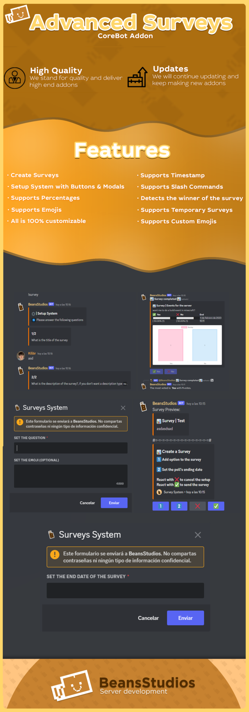

# Advanced Surveys - CoreBot Addon

Addon para **CoreBot** desarrollado con **JavaScript**, **Node.js** y **Discord.js**.

Este proyecto agrega un sistema avanzado de encuestas para servidores de Discord, pensado para comunidades, servidores de Minecraft y productos publicados en marketplaces de recursos digitales como **CoreMart** y **BuiltByBit**.

> **Estado:** Proyecto descontinuado.  
> Este addon fue creado para CoreBot. Como CoreBot fue descontinuado, este addon también dejó de recibir mantenimiento activo. El repositorio se conserva únicamente con fines de portafolio, documentación y demostración técnica.


## 🚀 Características

- Creación de encuestas personalizadas
- Sistema de configuración con botones
- Soporte para modales de Discord
- Soporte para porcentajes
- Soporte para emojis
- Soporte para emojis personalizados
- Soporte para timestamps
- Encuestas temporales
- Detección automática del ganador de la encuesta
- Soporte para slash commands
- Generación visual de resultados
- API propia para generación de imágenes
- Sistema configurable y personalizable
- Integración como addon para CoreBot
- Experiencia interactiva dentro de Discord
- Diseño visual para presentación del producto

## 🧩 Sistemas principales

### Sistema de encuestas

Permite crear encuestas dentro de Discord de forma interactiva.  
Los usuarios pueden configurar la pregunta, las opciones, los emojis y la fecha de finalización de la encuesta.

### Sistema de configuración

El addon incluye un flujo de configuración usando botones y modales, facilitando la creación de encuestas sin depender únicamente de comandos largos.

### Sistema de porcentajes

Las encuestas muestran resultados con porcentajes, permitiendo visualizar de forma clara la cantidad de votos por cada opción.

### Encuestas temporales

El sistema permite definir una fecha o tiempo de finalización para cerrar la encuesta automáticamente.

### Detección de ganador

Al finalizar una encuesta, el addon puede detectar automáticamente la opción ganadora según la cantidad de votos recibidos.

### API propia para generación de imágenes

El addon utilizaba una **API propia** para generar imágenes de resultados de encuestas, evitando cargar demasiada lógica visual dentro del bot principal.

Esta API procesaba los datos de la encuesta y devolvía una imagen lista para mostrar en Discord, facilitando la generación de resultados visuales con porcentajes y opciones votadas.

Actualmente, esta API ya no se encuentra activa debido a que el proyecto está descontinuado.

## 🛠️ Tecnologías

- JavaScript
- Node.js
- Discord.js
- Discord API
- CoreBot Addon System
- Embeds
- Buttons
- Modals
- Custom Emojis
- Timestamps
- Canvas / generación de imágenes
- API propia para resultados visuales
- YAML / JSON
- Git y GitHub
- Diseño gráfico para presentación de productos digitales

## 📌 Información del proyecto

- **Año:** 2023
- **Tipo:** Addon comercial para CoreBot
- **Autor:** Kill6r
- **Marketplace:** CoreMart
- **Estado:** Descontinuado
- **Motivo:** CoreBot fue descontinuado, por lo tanto el addon también dejó de recibir mantenimiento activo.

Este proyecto se conserva como parte de mi portafolio para demostrar experiencia desarrollando addons, sistemas interactivos para Discord, encuestas avanzadas, botones, modales, porcentajes, timestamps, resultados visuales y presentación de productos digitales.

## 🏪 Marketplace

Este addon fue publicado como recurso digital en **CoreMart** bajo el nombre **Surveys | Corebot Addon**.

También puede presentarse como un producto orientado a comunidades de Discord/Minecraft y marketplaces de recursos digitales como **BuiltByBit**, anteriormente conocido como **MC-Market**.

## 📸 Vista previa

Imagen promocional y capturas del addon en funcionamiento.  
El diseño visual de la presentación también fue realizado por mí.



> Para que la imagen se muestre correctamente en GitHub, el archivo debe estar en esta ruta exacta: `images/advanced-surveys-preview.png`.

## 📌 Casos de uso

Este addon podía utilizarse para:

- Encuestas en servidores de Discord
- Votaciones de comunidades
- Decisiones administrativas
- Eventos de servidores
- Votaciones en comunidades de Minecraft
- Sistemas de feedback
- Encuestas temporales
- Votaciones con resultados visuales
- Encuestas con botones y modales
- Encuestas con emojis personalizados

## ⚙️ Instalación

> Este proyecto está descontinuado y puede requerir versiones antiguas o específicas de CoreBot para funcionar correctamente.

Clona el repositorio:

```bash
git clone https://github.com/kill6r/advanced-surveys-corebot-addon.git
```

Entra a la carpeta del proyecto:

```bash
cd advanced-surveys-corebot-addon
```

Instala las dependencias si el proyecto las requiere:

```bash
npm install
```

Configura los archivos necesarios del addon según la estructura usada por CoreBot.

Ejemplo de configuración segura:

```yml
BOT_TOKEN: "YOUR_BOT_TOKEN"
CLIENT_ID: "YOUR_CLIENT_ID"
IMAGE_API_URL: "http://localhost:8250"
```

## 🖼️ API de imágenes

La versión original del addon utilizaba una API propia para generar imágenes de resultados de encuestas.

Esta API recibía los datos de la encuesta, procesaba los porcentajes y devolvía una imagen lista para enviarse en Discord.

Para esta versión de portafolio, la integración fue adaptada para usar variables de entorno en lugar de URLs internas.

```js
// Legacy image generation API used to create survey result images.
// The original production API is no longer active because the addon is discontinued.

const request = async (data) => {
  const imageApiUrl = process.env.IMAGE_API_URL || "http://localhost:8250";

  const res = await axios.post(`${imageApiUrl}/api/image`, data);
  return res;
};
```

## 🔐 Nota del proyecto

Esta versión del repositorio fue adaptada.  
Las credenciales, URLs internas y configuraciones privadas fueron reemplazadas por valores de ejemplo.

## 👨‍💻 Sobre el desarrollador

Desarrollado por **Kill6r**.

Soy desarrollador JavaScript con experiencia creando bots para Discord, Telegram y WhatsApp, addons para CoreBot, integraciones con APIs, sistemas de tickets, minijuegos, sistemas de encuestas, automatizaciones y herramientas personalizadas para comunidades online.

También cuento con experiencia en diseño visual para presentación de productos digitales, incluyendo imágenes promocionales y material gráfico para marketplaces.

## 📄 Licencia

Este proyecto está publicado únicamente con fines de portafolio, documentación y demostración técnica.

El uso, redistribución o modificación del código puede estar limitado si corresponde a una versión comercial o a una publicación original en marketplace.
